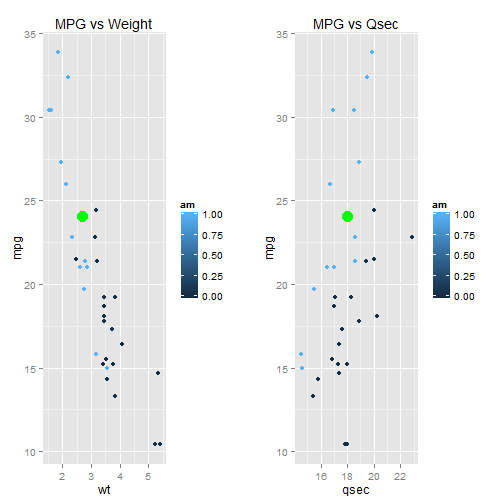

## Shine App Information

This application is built to demonstrate shiny app functionality. It is basically linear regression project. 

---
## Data Source

Source data is standard mtcars data set. 


```r
head(mtcars,10)
```

```
##                    mpg cyl  disp  hp drat    wt  qsec vs am gear carb
## Mazda RX4         21.0   6 160.0 110 3.90 2.620 16.46  0  1    4    4
## Mazda RX4 Wag     21.0   6 160.0 110 3.90 2.875 17.02  0  1    4    4
## Datsun 710        22.8   4 108.0  93 3.85 2.320 18.61  1  1    4    1
## Hornet 4 Drive    21.4   6 258.0 110 3.08 3.215 19.44  1  0    3    1
## Hornet Sportabout 18.7   8 360.0 175 3.15 3.440 17.02  0  0    3    2
## Valiant           18.1   6 225.0 105 2.76 3.460 20.22  1  0    3    1
## Duster 360        14.3   8 360.0 245 3.21 3.570 15.84  0  0    3    4
## Merc 240D         24.4   4 146.7  62 3.69 3.190 20.00  1  0    4    2
## Merc 230          22.8   4 140.8  95 3.92 3.150 22.90  1  0    4    2
## Merc 280          19.2   6 167.6 123 3.92 3.440 18.30  1  0    4    4
```

---
## Model description

We build a linear regression model to predict miles per gallon (mpg) with 3 variables :

* Q Sec
* Car weight
* Transmission type


```r
fit3 <- lm(mpg ~ wt + am + qsec, data=mtcars)  
```

---
## Input and output

You can change input variables on left pane, and you can see results on right pane:

* Expected value for miles per gallon
* Plot that demonstrates predicted value vs training data.

We do prediction with standard function predict.lm


```r
mpg<-predict.lm(fit3, newdata=data.frame(wt,qsec,am))
```

---
## Results

You can see data with plot and text output.


```
##        1 
## 24.04501
```

```
## Loading required package: grid
```

 


